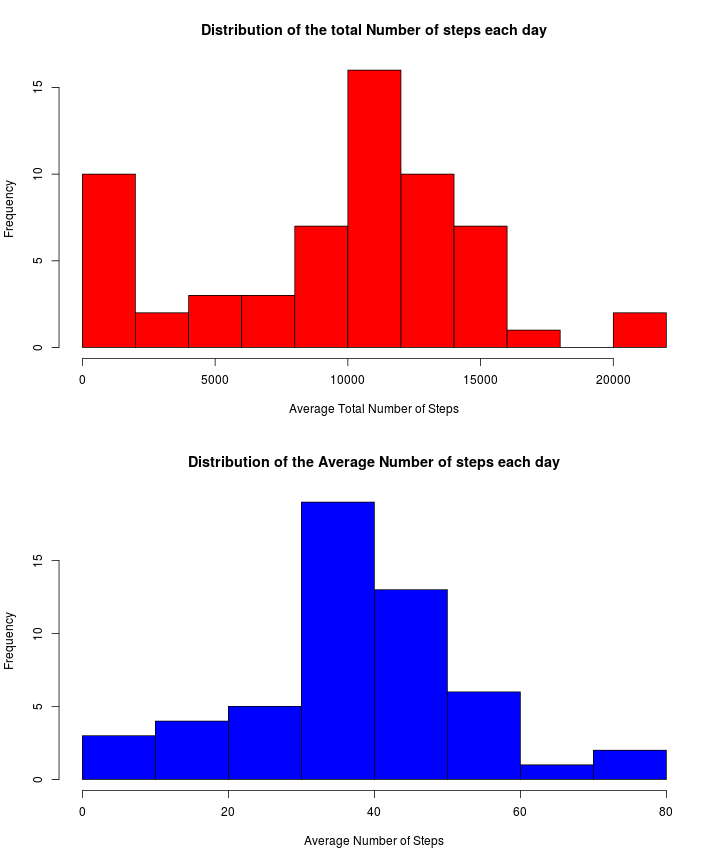
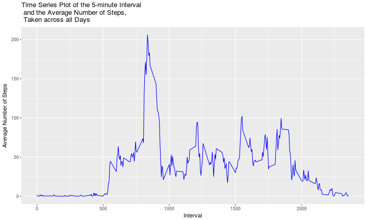
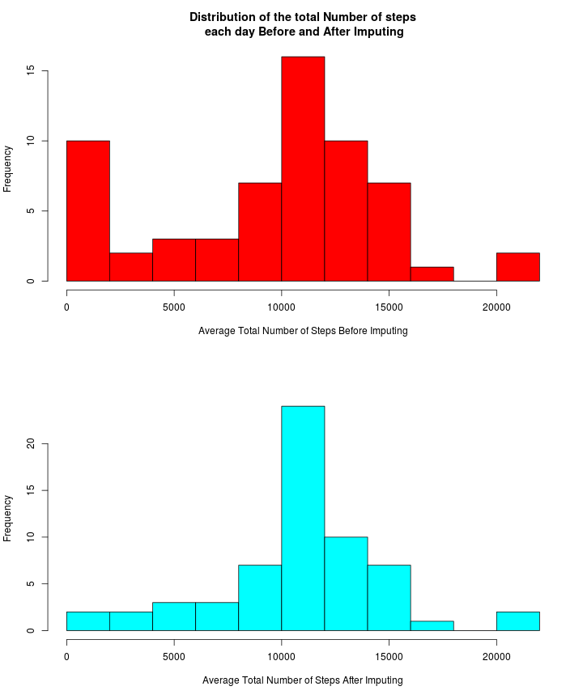
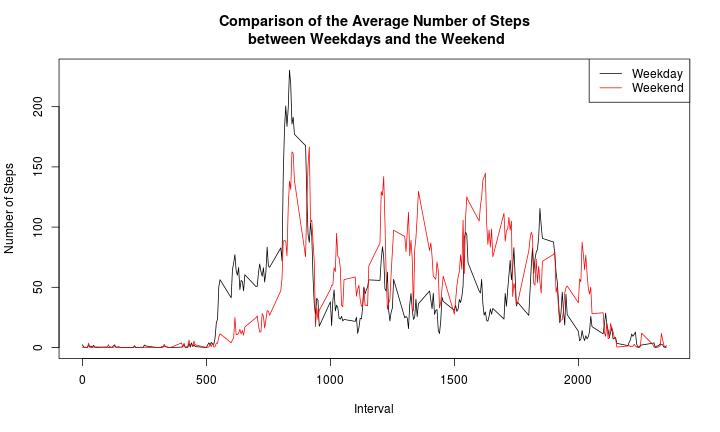
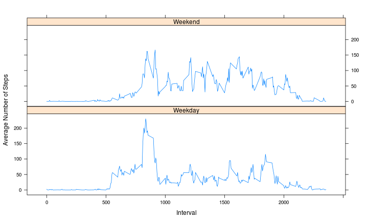
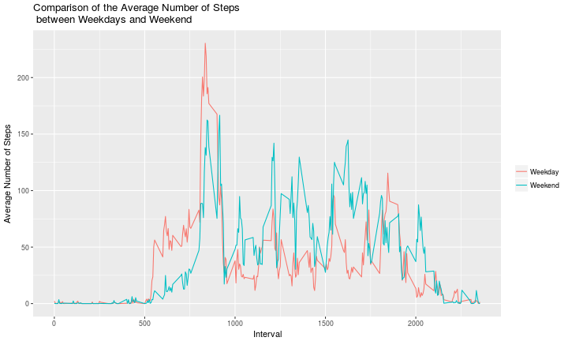

# Reproducible Research: Peer Assessment 1

## Introduction
It is now possible to collect a large amount of data about personal movement using activity monitoring devices such as a Fitbit, Nike Fuelband, or Jawbone Up. These types of devices are part of the “quantified self” movement – a group of enthusiasts who take measurements about themselves regularly to improve their health, to find patterns in their behavior, or because they are tech geeks. But these data remain under-utilized both because the raw data are hard to obtain and there is a lack of statistical methods and software for processing and interpreting the data.

This assignment makes use of data from a personal activity monitoring device. This device collects data at 5 minute intervals through out the day. The data consists of two months of data from an anonymous individual collected during the months of October and November, 2012 and include the number of steps taken in 5 minute intervals each day.

## Loading and preprocessing the data

```r
# Set working directory
# setwd("/home/sagar/RepData_PeerAssessment1")

# Url of the data zip file
fileUrl <- "https://d396qusza40orc.cloudfront.net/repdata%2Fdata%2Factivity.zip"

# Downlaod zip file
# download.file(fileUrl, destfile="activity.zip", method="curl")

# Unzip the data file. Use read.csv() to load the data set into R
activity <- read.csv(unz("repdata_data_activity.zip", "activity.csv"))
activityCopy <- activity

# Convert date to date class
activity$Date <- as.Date(activity$date, "%Y-%m-%d")

# Convert interval to a factor
activity$interval <- as.factor(activity$interval)

# Exrtract levels of 5-min intervals
l <- levels(activity$interval)
```
## Average total number of steps taken per day

```r
# Use tapply function to find the total, mean and median number of steps each day
totalSteps <- tapply(activity$steps, activity$date, sum, na.rm=T)
avgSteps <- tapply(activity$steps, activity$date, mean, na.rm=T)
par(mfrow=c(2,1))
hist(totalSteps, breaks=10, col="red", main="Distribution of the total Number of steps each day", xlab="Average Total Number of Steps")
hist(as.vector(avgSteps), breaks=10, col="blue", main="Distribution of the Average Number of steps each day", xlab="Average Number of Steps")
```



## Average daily activity pattern

```r
# Find the average number of steps grouped by intereval
Steps = tapply(activity$steps, activity$interval, mean, na.rm=T)

# Convert levels of intervals into numeric
Interval <- as.numeric(l)

# Create the dataframe df of the Interval and Steps columns
df <- data.frame(Steps, Interval)
```


```r
library(ggplot2)
```

```
## Stackoverflow is a great place to get help:
## http://stackoverflow.com/tags/ggplot2.
```

```r
g <- ggplot(df, aes(Interval, Steps))
g + geom_line(colour="blue")+ggtitle("Time Series Plot of the 5-minute Interval\n and the Average Number of Steps,\n Taken across all Days") + ylab("Average Number of Steps")
```



## Imputing missing values

```r
# Missing data
missing <- is.na(activity)
# Number of missing values
(n.missing <- sum(missing))
```

```
## [1] 2304
```

```r
# Impute data using the mice (multivariate imputation chains equation)
library(mice)
```

```
## Error in library(mice): there is no package called 'mice'
```

```r
library(Amelia)
```

```
## Error in library(Amelia): there is no package called 'Amelia'
```

```r
set.seed(144)
# imputedData <- complete(mice(activity))
# Number of total steps each day after imputation
# a.out <- amelia(activityCopy, cs="date", m=1)
# Data frame after imputing
# a <- a.out$imputations$imp1
# totStepsImp <- tapply(a$steps, a$date, sum)


# Impute by replacing NA by the mean of steps
activityCopy$steps[is.na(activityCopy$steps)] <- tapply(activityCopy$steps, activityCopy$interval, mean, na.rm = TRUE)
# Number of total steps each day
totStepsImp <- tapply(activityCopy$steps, activityCopy$date, sum)

# Summary statistics before and after imputing
summary(totalSteps)
```

```
##    Min. 1st Qu.  Median    Mean 3rd Qu.    Max. 
##       0    6778   10395    9354   12811   21194
```

```r
summary(totStepsImp)
```

```
##    Min. 1st Qu.  Median    Mean 3rd Qu.    Max. 
##      41    9819   10766   10766   12811   21194
```

There does not seem to be a significant difference in the average number of total steps each day before and after imputing. 


More information about the mice and Amelia packages can be found here [mice][1] and here [amelia][2]
[1]: http://doc.utwente.nl/78938/1/Buuren11mice.pdf
[2]: http://cran.r-project.org/web/packages/Amelia/vignettes/amelia.pdf

```r
# Compare total number of steps each day before and after imputing 
par(mfrow=c(2,1))
hist(totalSteps, col="red", xlab="Average Total Number of Steps Before Imputing", main="", breaks=10)
title("Distribution of the total Number of steps\n each day Before and After Imputing")
hist(totStepsImp, col="cyan", main="", xlab="Average Total Number of Steps After Imputing", breaks=10)
```



## Are there differences in activity patterns between weekdays and weekends?

```r
# Extract weekdays
activityCopy$Days <- weekdays(as.Date(as.character(activityCopy$date)))
# Create a logical vector d where Days are Saturday or Sunday
d <- activityCopy$Days=="Saturday" | activityCopy$Days=="Sunday"
# Call Saturday and Sunday Weekend
activityCopy$Days[d] = "Weekend"
# Call weekdays (Monday through Friday) Weekdays
activityCopy$Days[!d] = "Weekday"

# Weekdays 
activityCopyWD <- activityCopy[activityCopy$Days == "Weekday",]
# Weekend
activityCopyWE <- activityCopy[activityCopy$Days == "Weekend",]
# Convert levels of interval into numeric for weekdays
IntervalWD <- as.numeric(levels(as.factor(activityCopyWD$interval)))
# Convert levels of interval into numeric for the weekend
IntervalWE <- as.numeric(levels(as.factor(activityCopyWE$interval)))
# Average number of steps during weekdays
avgWD <- tapply(activityCopyWD$steps, activityCopyWD$interval, mean)
# Average number of steps during the weekend
avgWE <- tapply(activityCopyWE$steps, activityCopyWE$interval, mean)
# Data frame combining average number of steps and interval during weekdays
dfWD <- data.frame(avgWD, IntervalWD)
# Data frame combining average number of steps and interval during the weekend
dfWE <- data.frame(avgWE, IntervalWE)
# Convert Days into factor
#activityCopy$Days <- as.factor(activityCopy$Days)

#activityCopy$interval <- factor(activityCopy$interval)
```


```r
# Use base plot
plot(dfWD$IntervalWD, dfWD$avgWD, type='l', main="Comparison of the Average Number of Steps\n between Weekdays and the Weekend", xlab="Interval", ylab="Number of Steps")
lines(dfWE$IntervalWE, dfWE$avgWE, col="red")
legend("topright", c("Weekday", "Weekend"), col=c("black", "red"), lty=1)
```



```r
#plot(dfWE$IntervalWE, dfWE$avgWE, type='l', main="Weekend", xlab="Interval", ylab="Number of Steps")
```


```r
# Use the lattice Package

# Add a column to the data frames that include weekdays and weekend days
dfWD$wDays <- rep("Weekday", nrow(dfWD))
dfWE$wDays <- rep("Weekend", nrow(dfWD))
# Rename column names to match
colnames(dfWD) <- c("Steps", "Interval", "wDays")
colnames(dfWE) <- c("Steps", "Interval", "wDays")
# rbind the dataframes
df <- rbind(dfWD, dfWE)
# Convert wDays column into a factor
df$wDays <- factor(df$wDays)

# Use lattice library to plot
library(lattice)
xyplot(Steps ~ Interval | wDays, data=df, type='l', layout=c(1,2), ylab="Average Number of Steps")
```




```r
# Using ggplot2 package
g <- ggplot(df, aes(Interval, Steps, fill=wDays, colour=wDays))
g + geom_line() + labs(colour="") + ggtitle("Comparison of the Average Number of Steps\n between Weekdays and Weekend") + ylab("Average Number of Steps")
```



Although the maximum average number of steps during weekdays is higher than that during the weekend, there seems to be on average more activities during the weekend. However, in both weekdays and weekend, most activities seem to take place between 8:30 and 9:30 in the morning. Also, there seems to be no activities between midnight and 5:00 AM throughout the week. Moreover, there are on average more activities during the weekend between 10:00 AM and 8:00 PM. 
